# flow.md — how it works, drawn

> Diagrams over prose. Mermaid renders on GitHub and in most editors.
> Update when a flow changes shape, not when a field is added.

**Last updated:** 2026-09-13

---

## 1. System, today

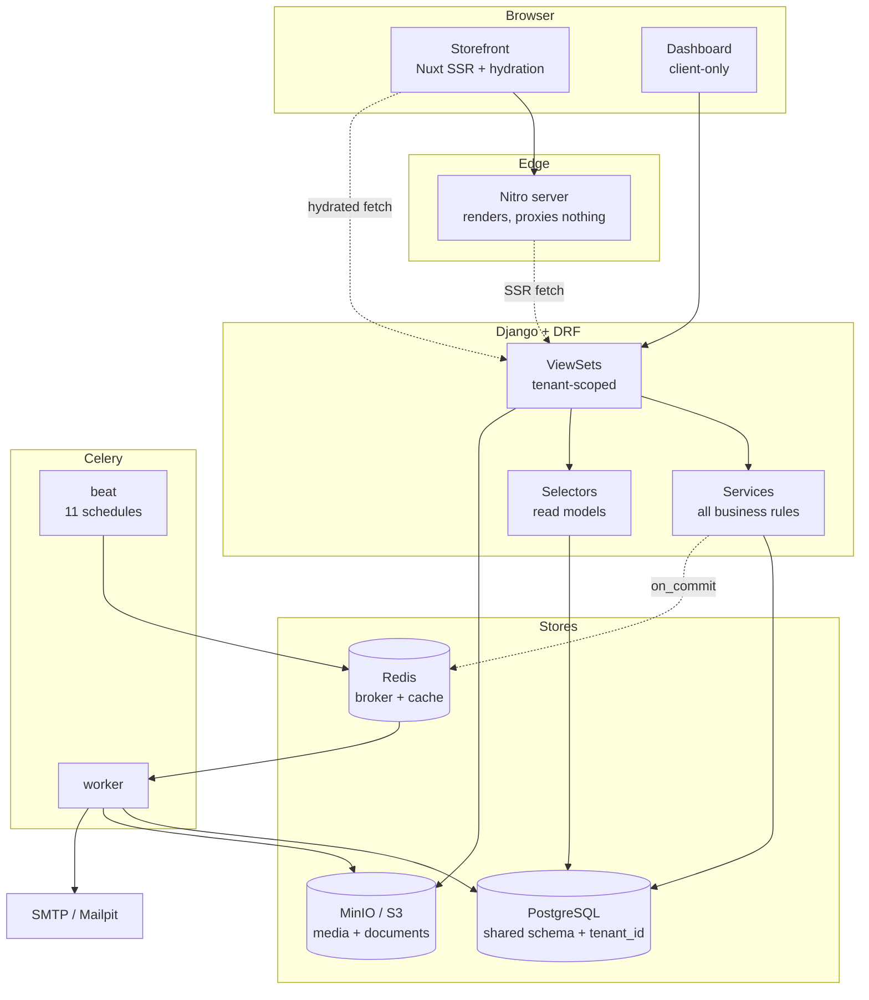

**Rule:** views never contain business rules. A view validates, calls a service,
serialises. This is why a bug is almost always in `services.py`.

---

## 2. Checkout — the money path

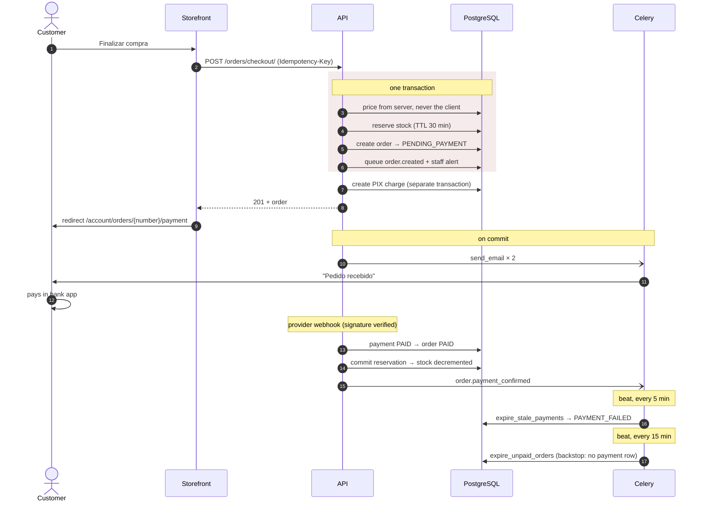

> **Why the backstop exists.** `_checkout` is not atomic end to end: the order
> commits, then the charge is created. If the provider is down, the order exists
> with no payment row and nothing in the payments layer can ever resolve it.

---

## 3. Order state machine

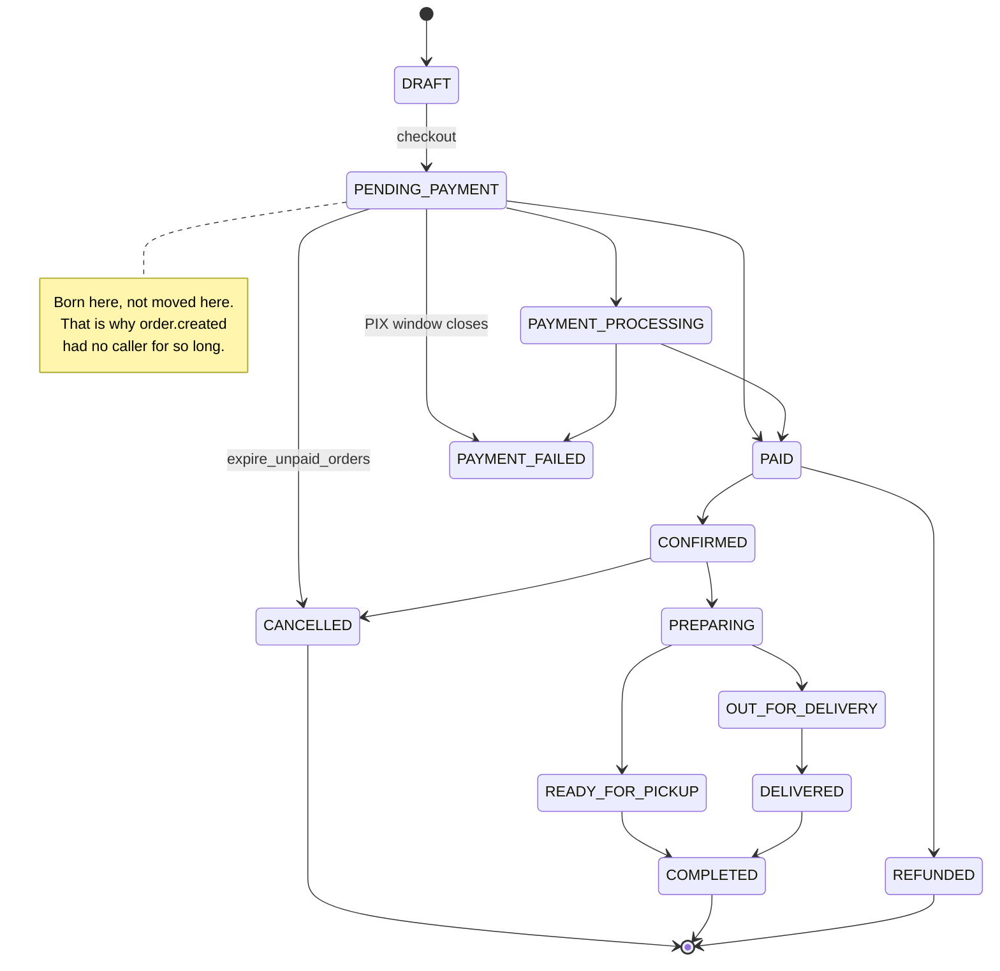

---

## 4. Stock — a ledger, not a number

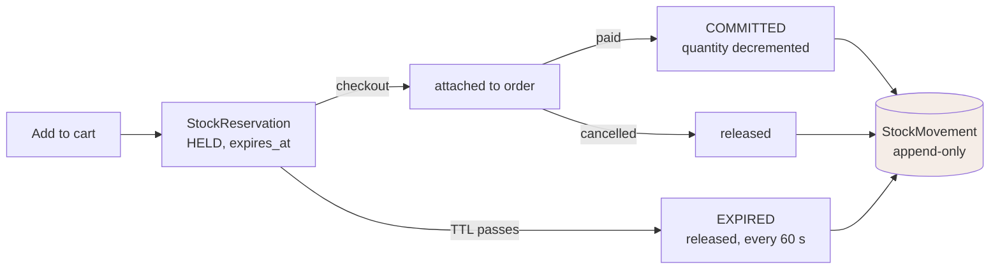

`available = quantity − reserved`. That is the number a shopkeeper acts on, and
the one the storefront shows as "Indisponível".

---

## 5. Media pipeline — before and after

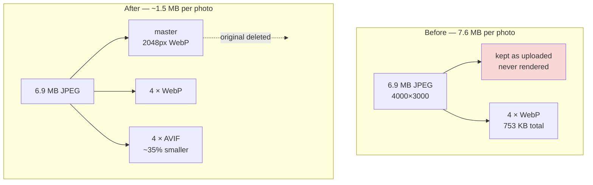

Render side:

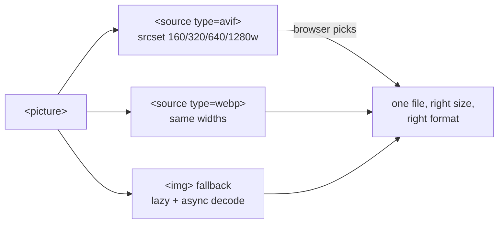

---

## 6. Spreadsheet import — three gates

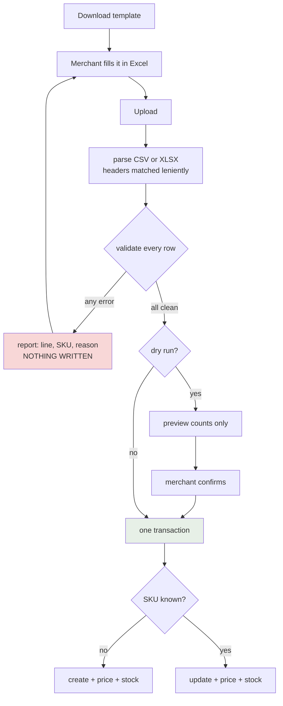

---

## 7. Home page — now vs next

**Now** — bands in the merchant's order, each toggleable:

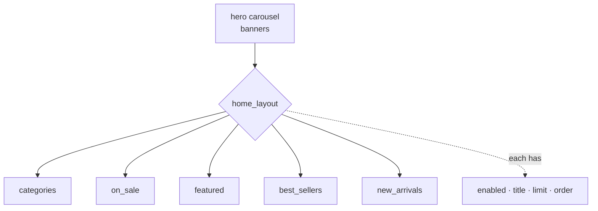

**Next** — parallax bands between the content (phase 5):

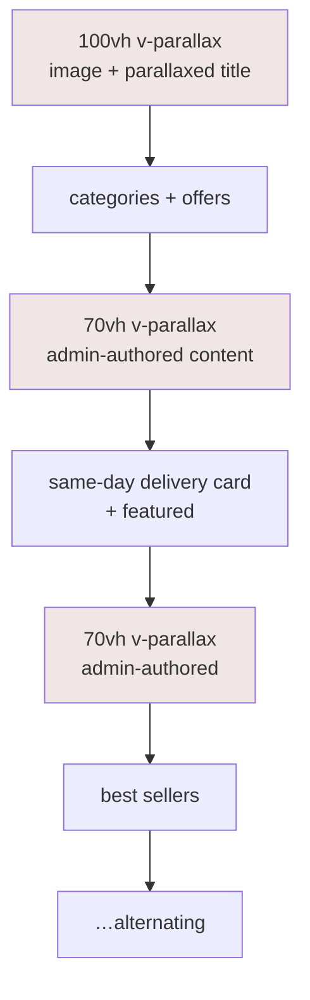

Each parallax band becomes a configurable section: image, heading, body, CTA,
and an on/off switch in `/admin/storefront`. A shop that wants a short page
turns them all off and loses nothing.

---

## 8. Data model — the core

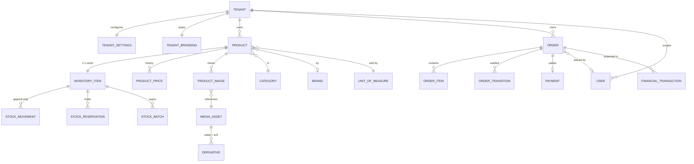

`ORDER_ITEM` stores a **snapshot** — name, SKU, unit price, unit cost — so a
later price change cannot rewrite history.

---

## 9. Scheduled work

```mermaid
gantt
    title Celery beat — 11 entries
    dateFormat X
    axisFormat %s

    section Seconds
    release_expired_reservations (60s)   :0, 60
    section Minutes
    expire_stale_payments (5m)           :0, 300
    project_paid_orders_to_ledger (5m)   :0, 300
    reconcile_pending_payments (10m)     :0, 600
    retry_failed_emails (10m)            :0, 600
    expire_unpaid_orders (15m)           :0, 900
    section Hourly / daily
    purge_expired_tokens (1h)            :0, 3600
    cleanup_orphaned_assets (03:30)      :0, 3600
    cleanup_old_report_jobs (03:45)      :0, 3600
    cleanup_old_notifications (04:00)    :0, 3600
    notify_low_stock (07:00)             :0, 3600
```

Seven of these were added in phase 2. They existed as code and were never
scheduled — see `historic.md`.

---

## 10. Request lifecycle

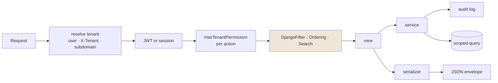

> `SearchFilter` sat outside that chain until phase 2, which is why `?search=`
> answered 200 and filtered nothing on seven tables.


---

## 11. Back-in-stock — turning a lost sale into a signal

The only view this platform has onto demand that produced **no order**. A sales
report cannot show it, because nothing was sold.

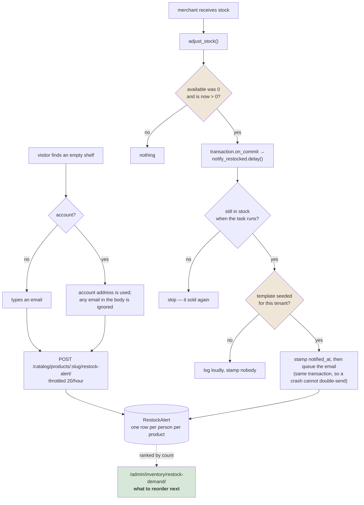

Three guards, each for a failure that actually happened or would have:

- **the transition, not the increase** — receiving more of something already in
  stock is not news;
- **re-check availability in the task** — it is queued on commit and runs later;
  the two units that arrived may already be gone;
- **check the template exists before stamping anyone** —
  `queue_transactional_email` returns `None` both for "already queued" and "no
  such template", and the first run of this stamped a waiting shopper as
  notified and sent them nothing.

---

## 12. Finance — one ledger, four questions

`services.py` writes. `analysis.py` only reads. Nothing recomputes a figure the
other already produces, because two implementations of "revenue" eventually
disagree and the one on screen is never the one someone checked.

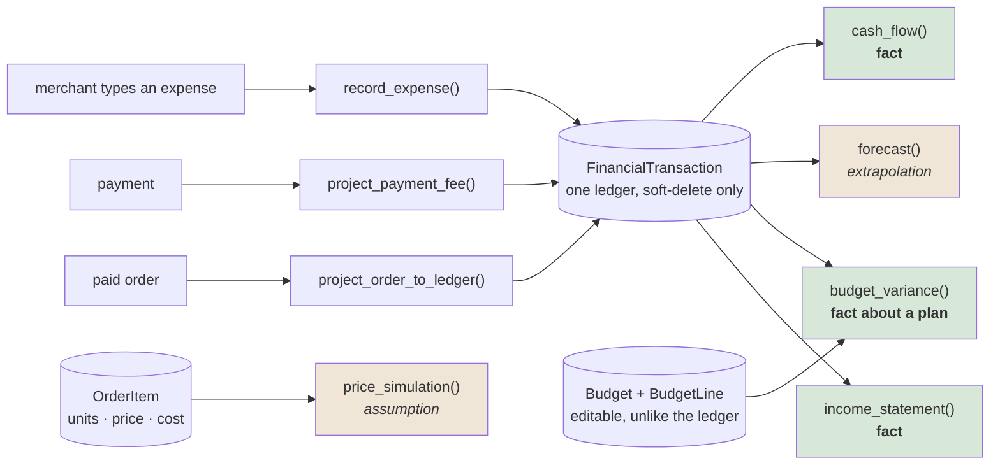

Green is arithmetic over recorded rows. Amber is a guess, and says so on screen:
the forecast carries its basis in months and a confidence band; the simulation
carries the elasticity it used.

**Why the simulation reads order lines and not the ledger.** The ledger has no
units in it, and a margin without units cannot be re-priced.

### The DRE, in the order it is read

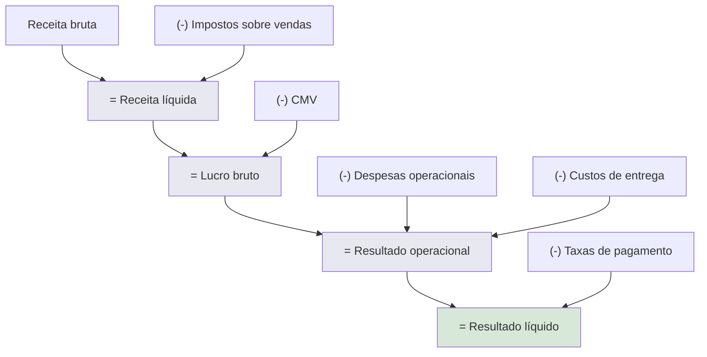

> Tax on sales is a **deduction from revenue**, above the gross-profit line —
> not an operating cost beside rent. Putting it below would overstate gross
> margin on every statement.

Each line also carries **AV** (its share of net revenue) and **AH** (change
against the previous period *of the same length* — comparing 31 days against 28
makes February read as a collapse every year).

---

## 13. Images at ten thousand products

Before this phase the conversion was already right. What was missing was
everything that decides whether the shop is *fast*.

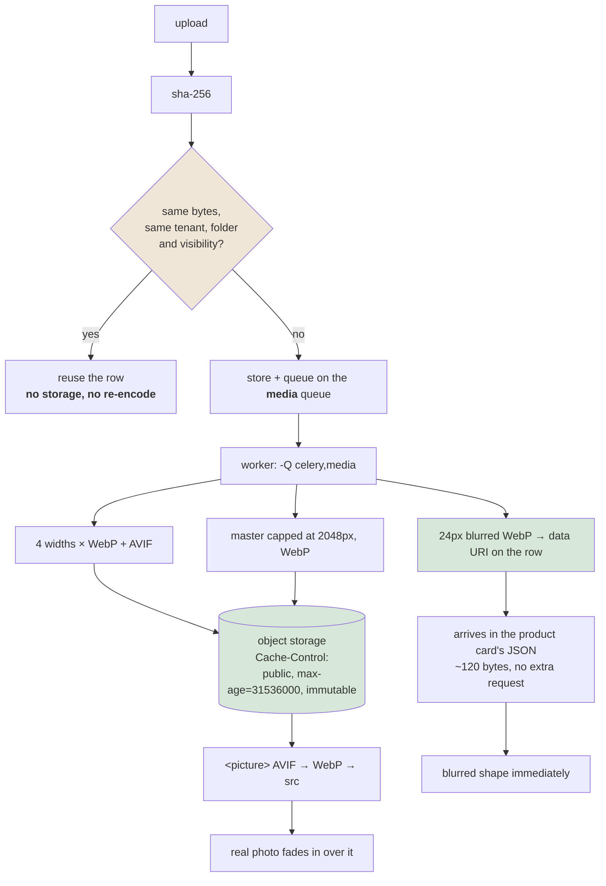

| Fix | Why it matters at 10k products |
|---|---|
| `Cache-Control … immutable` | ~240,000 objects were being re-fetched on every return visit. Keys embed the asset UUID and a reprocess writes a *new* key, so `immutable` is honest |
| checksum dedupe | a supplier catalogue repeats one photo across a dozen flavours; each copy was stored and re-encoded eight times |
| `media` queue | 10,000 imports queued ahead of the order confirmation a customer is waiting for |
| LQIP | a grey rectangle reads as broken; a blurred shape reads as loading |

---

## 14. Diagnostics — reporting on a system that may be broken

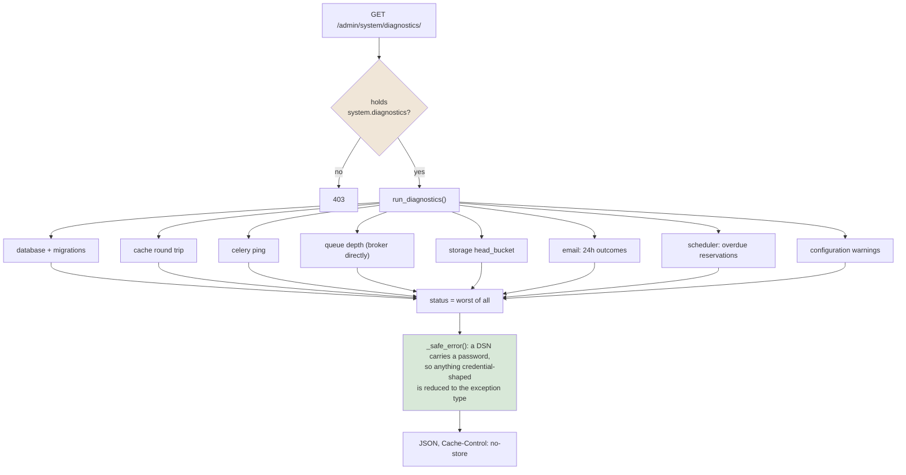

Three rules this page is built on:

1. **Never a secret.** Not even masked — a masked secret still discloses length
   and shape. `secret_key_set: true`, never the key.
2. **Never another tenant's data.** Infrastructure checks report *liveness only*;
   the counts are tenant-scoped.
3. **Never block.** Every probe has a timeout and every failure is caught. A
   diagnostics page that dies with its dependency removes the one screen that
   would have said so.

**Why a capability and not a page code.** Page codes here are hierarchical —
holding `perm.admin` grants everything under it. Expressing this as
`perm.admin.diagnostics` alone would hand queue depth, storage state and
configuration warnings to every staff member who can open the dashboard.
`system.diagnostics` is granted only where it is listed, and it is listed only
for administrators.

---

## 15. Where a new permission or template actually goes

The shape of a bug this project has now hit three times.

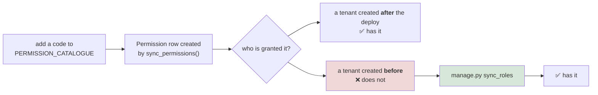

Identical for `DEFAULT_TEMPLATES` → `sync_email_templates`. The failure mode is
the worst kind: it works on a fresh database and on every test run, and is dead
in the one place that matters.


---

## 16. Parallax — why the strip was blank, and why it cannot be again

The bug was not a missing pixel count. It was two numbers that had to agree and
never did: travel was a fraction of the **scroll distance**, overscan a fraction
of the **element height**.

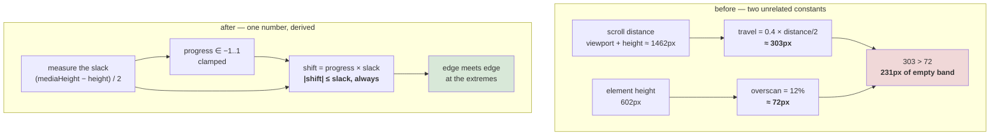

Raising the overscan would have papered over it at one viewport and failed at
the next — one side of the mismatch scales with the window and the other does
not. Deriving travel from the measured slack makes the failure *impossible*
rather than unlikely, and leaves the overscan as the only knob: raising it now
strengthens the effect and can never expose an edge.

Shared by the hero and the bands as `parallaxShift()`, and tested across 5
viewports × 6 heights × 5 overscans × every position. One test encodes the old
formula and asserts it breaches, so the guard cannot quietly stop guarding.

---

## 17. FAQs — draft, published, and what a visitor sees

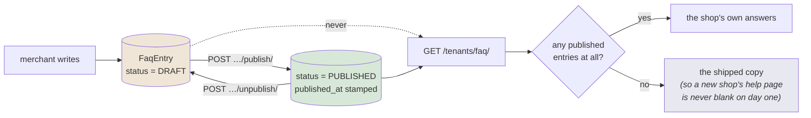

Three decisions worth keeping:

- **Two states, not a visibility flag.** The useful thing is writing an answer
  over several sittings without it being live in between. An `is_active`
  boolean gives you that too, but names it so badly that people use it as
  "temporarily hidden" and lose track of which is which.
- **Unpublishing keeps the copy.** It is hiding, not deleting.
- **Merchant copy replaces the shipped copy wholesale.** Interleaving would put
  their delivery window beside ours on the same page, with no way to remove the
  one they disagree with.

---

## 18. Where a product's photos and stock rules live

Both are edited on the product form and neither is stored on `Product`.

```mermaid
flowchart TD
    F["product dialog"] --> G["gallery: ordered list<br/>of {id, caption}"]
    F --> S["thresholds:<br/>low · minimum · track"]

    G --> SER["ProductAdminSerializer"]
    S --> SER

    SER --> CHK{"every asset<br/>owned by this tenant?"}
    CHK -- no --> ERR["<b>400</b> — refuse.<br/>Filtering silently turned one bad id<br/>into &quot;all my photos vanished&quot;"]
    CHK -- yes --> ROWS[("ProductImage rows rebuilt<br/>position = index<br/>is_primary = index 0")]

    SER --> INV[("InventoryItem<br/>reorder_threshold · minimum_stock · track_stock")]
    INV --> CACHE["product.inventory = item<br/><i>or the response echoes pre-save values</i>"]

    INV --> FLAG["is_low_stock"]
    FLAG --> SCREENS["Estoque · Saúde do estoque"]

    style ERR fill:#f0d8d8
    style CACHE fill:#f0e6d8
    style SCREENS fill:#d8e8d8
```

**Why the rows are rebuilt rather than diffed.** Position and primacy are
properties of the *list*, not of any one row — dragging the third photo to the
front changes two rows, and reconciling that is more code than writing four rows
again.

**Why thresholds do not go through `adjust_stock`.** They are a rule *about* the
stock, not a change *to* it. Routing them through the ledger would write a
movement row saying nothing moved.

**Why `product.inventory = item` is not incidental.** `get_or_create_item`
returns a different Python object from the one the product's relation cache
holds, so without it the API answered `5.000` while the database held `12.000`.

---

## 19. Counting a category's products

```mermaid
flowchart LR
    C["category row"] --> OWN["own_products<br/>Count(products, active)"]
    C --> KIDS["child_products<br/>Count(children__products, active)"]
    OWN --> SUM["product_count = own + children"]
    KIDS --> SUM

    SUM --> UI["&quot;10 produtos&quot;"]
    FILT["ProductFilter.filter_category<br/><i>includes descendants</i>"] -.->|"must agree"| SUM

    style SUM fill:#d8e8d8
```

The count includes descendants because **tapping the category in the shop shows
them**. A root reading "0 produtos" while a tap on it lists forty is a number
that teaches people to distrust the screen.

It read 0 for everything before this: the serializer declared `product_count`
with a default of `0` and the admin queryset never annotated it. Verified by
reconciliation — all 8 roots now sum to exactly the 51 products that exist.

---

## 20. The admin chrome, as it now stands

```mermaid
flowchart TD
    subgraph BAR["v-app-bar"]
        R1["row 1 · 64px — identity, store, language, theme, account"]
        SEAM["border-top on the extension<br/><i>a v-divider here rendered at width: 0</i>"]
        R2["row 2 · 52px — search ⌘K · quick create · alerts · storefront · fullscreen"]
    end

    RAIL["rail · 72px<br/>grid-template-columns: 24px 0 0<br/>--v-list-prepend-gap: 0"]

    MAIN["v-main → page content"]
    FOOT["footer, in the flow<br/>store · environment · live status · links"]

    BAR --> MAIN
    RAIL --> MAIN
    MAIN --> FOOT

    PULSE[("useAdminPulse")] --> R2
    PULSE --> FOOT

    style SEAM fill:#f0e6d8
    style PULSE fill:#e8e8f0
```

The footer reads the same `useAdminPulse` the header badge does, so the two
cannot disagree about whether anything needs attention — and it sits in the
content flow rather than pinned, so it never covers a table's last row.
