# flow.md — how it works, drawn

> Diagrams over prose. Mermaid renders on GitHub and in most editors.
> Update when a flow changes shape, not when a field is added.

**Last updated:** 2026-09-13

---

## 1. System, today

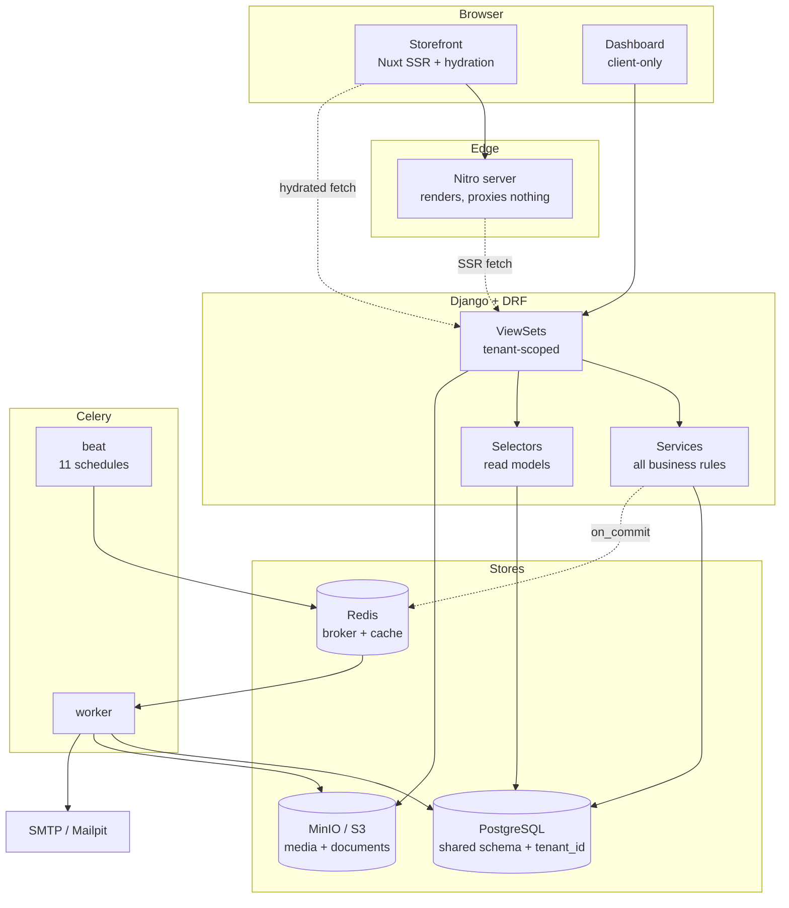

**Rule:** views never contain business rules. A view validates, calls a service,
serialises. This is why a bug is almost always in `services.py`.

---

## 2. Checkout — the money path

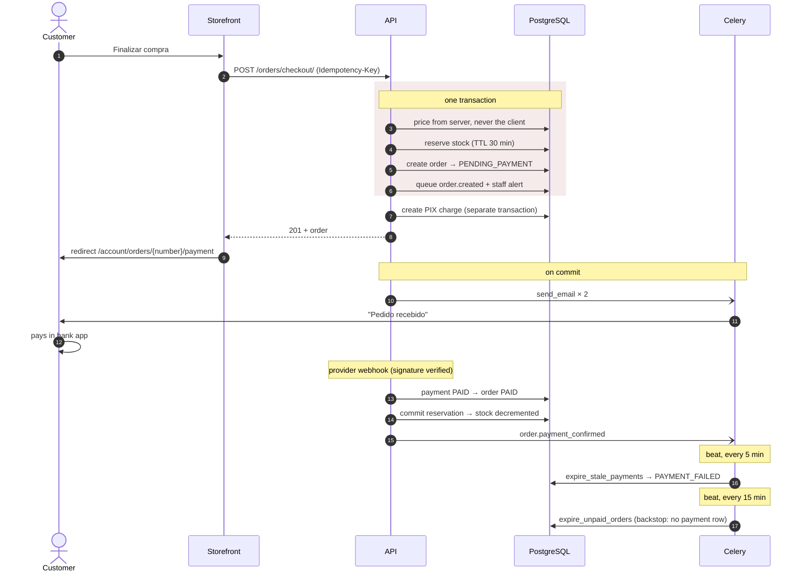

> **Why the backstop exists.** `_checkout` is not atomic end to end: the order
> commits, then the charge is created. If the provider is down, the order exists
> with no payment row and nothing in the payments layer can ever resolve it.

---

## 3. Order state machine

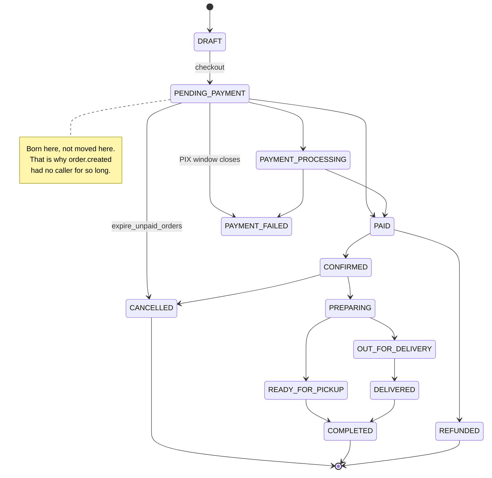

---

## 4. Stock — a ledger, not a number

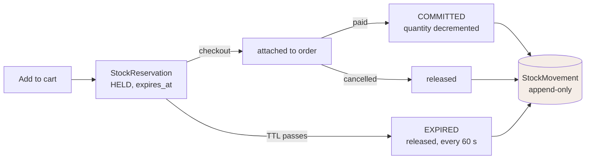

`available = quantity − reserved`. That is the number a shopkeeper acts on, and
the one the storefront shows as "Indisponível".

---

## 5. Media pipeline — before and after

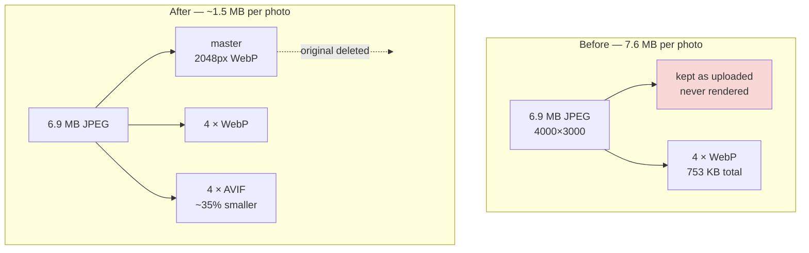

Render side:

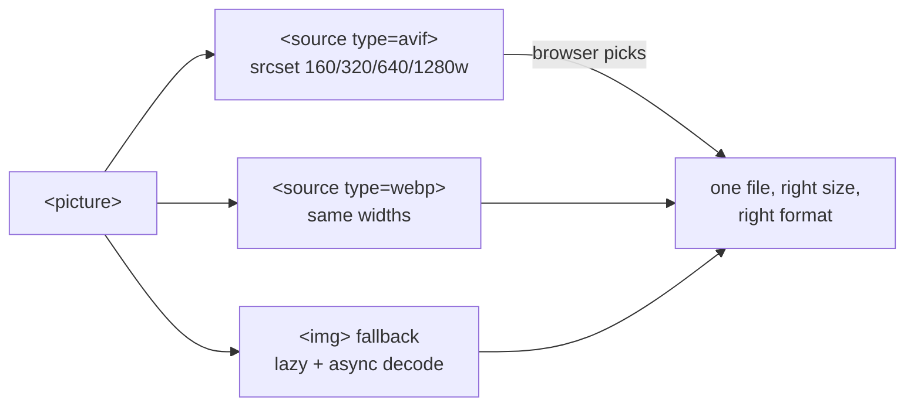

---

## 6. Spreadsheet import — three gates

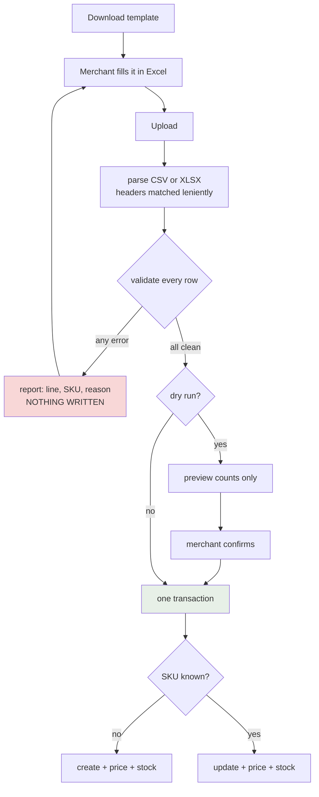

---

## 7. Home page — now vs next

**Now** — bands in the merchant's order, each toggleable:

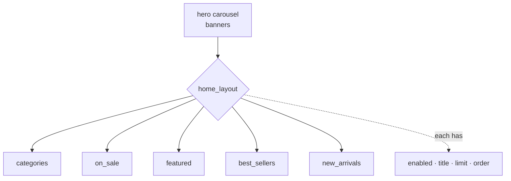

**Next** — parallax bands between the content (phase 5):

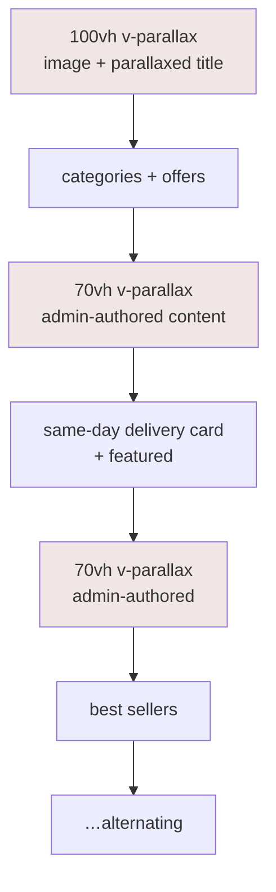

Each parallax band becomes a configurable section: image, heading, body, CTA,
and an on/off switch in `/admin/storefront`. A shop that wants a short page
turns them all off and loses nothing.

---

## 8. Data model — the core

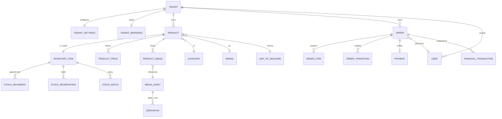

`ORDER_ITEM` stores a **snapshot** — name, SKU, unit price, unit cost — so a
later price change cannot rewrite history.

---

## 9. Scheduled work

```mermaid
gantt
    title Celery beat — 11 entries
    dateFormat X
    axisFormat %s

    section Seconds
    release_expired_reservations (60s)   :0, 60
    section Minutes
    expire_stale_payments (5m)           :0, 300
    project_paid_orders_to_ledger (5m)   :0, 300
    reconcile_pending_payments (10m)     :0, 600
    retry_failed_emails (10m)            :0, 600
    expire_unpaid_orders (15m)           :0, 900
    section Hourly / daily
    purge_expired_tokens (1h)            :0, 3600
    cleanup_orphaned_assets (03:30)      :0, 3600
    cleanup_old_report_jobs (03:45)      :0, 3600
    cleanup_old_notifications (04:00)    :0, 3600
    notify_low_stock (07:00)             :0, 3600
```

Seven of these were added in phase 2. They existed as code and were never
scheduled — see `historic.md`.

---

## 10. Request lifecycle

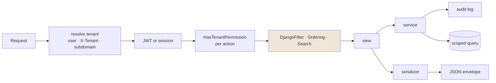

> `SearchFilter` sat outside that chain until phase 2, which is why `?search=`
> answered 200 and filtered nothing on seven tables.
